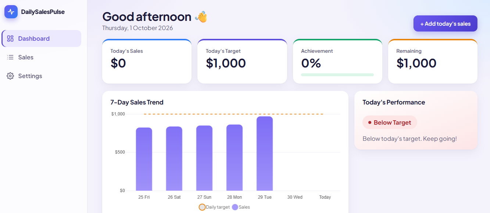

# DailySalesPulse

A lightweight sales-tracking MVP for small businesses. Enter daily sales and instantly see how today compares to your target — no more finding out at month-end.

## Features

- **Daily sales tracking** – add, edit, view and delete sales (with an optional note)
- **Target progress** – today's sales, target, achievement % and remaining amount
- **7-day trend** – bar chart of the last 7 calendar days (days without sales show as 0)
- **Sales history** – filter by date, view / edit / delete
- **Simple settings** – daily target and one currency (USD, EUR, GBP, PKR)

Status rules: `sales >= target` → **Target Achieved**, `sales >= 80% of target` → **Near Target**, otherwise **Below Target**. With a target of 0 there is no division by zero: any sale counts as achieved (100%).

## Tech Stack

Angular 20 · Angular Material (dialogs/toasts) · Chart.js · Node.js · Express 5 · SQLite (better-sqlite3) · TypeScript

## Run Locally

Requires Node.js 22.12+ (the Angular 20 CLI supports 20.19+/22.12+).

```bash
npm run install:all      # install backend + frontend dependencies
npm run dev:api          # terminal 1 → API on http://localhost:3000
npm run dev:web          # terminal 2 → app on http://localhost:4200
```

The SQLite database is created automatically at `backend/data/sales.db` on first start (default target: 1000 USD).

Build and test:

```bash
npm run build
npm test                 # backend (Vitest) + frontend (Karma, needs Chrome)
```

Optional env vars for the API: `PORT` (3000), `DB_FILE`, `CORS_ORIGIN` (`http://localhost:4200`).

## API

| Method | Path | Purpose |
| --- | --- | --- |
| GET | `/api/dashboard` | Today's numbers, status, 7-day trend |
| GET / POST | `/api/sales` | List (optional `?search=YYYY-MM-DD`) / create |
| GET / PUT / DELETE | `/api/sales/:id` | Read / update / delete |
| GET / PUT | `/api/settings` | Daily target and currency |

Errors return `{ "error": "...", "details": [...] }` with 400 / 404 / 500; internals are only logged server-side.

## Screenshots

### Dashboard



## Project Purpose

A small MVP demonstrating Angular, a REST API, SQLite persistence, dashboard design and basic business analytics. It is intentionally local-only and has no authentication, users or multi-tenancy.
